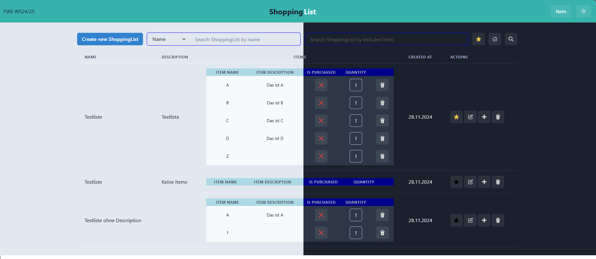
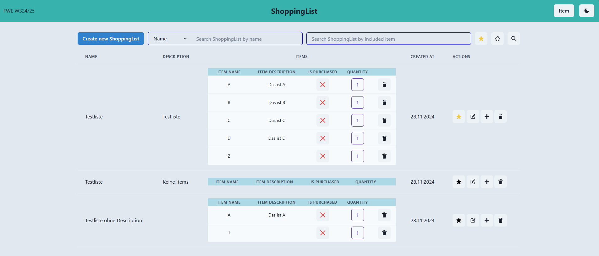
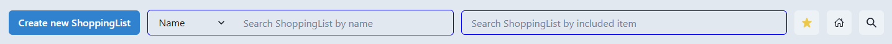
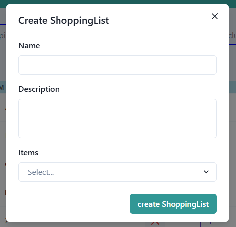
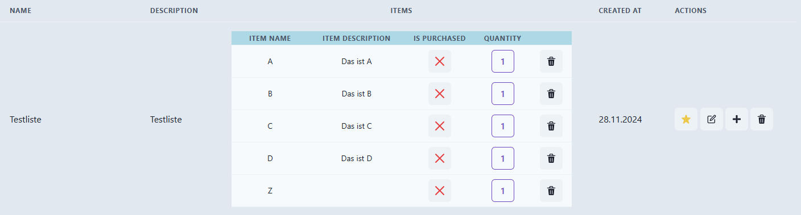
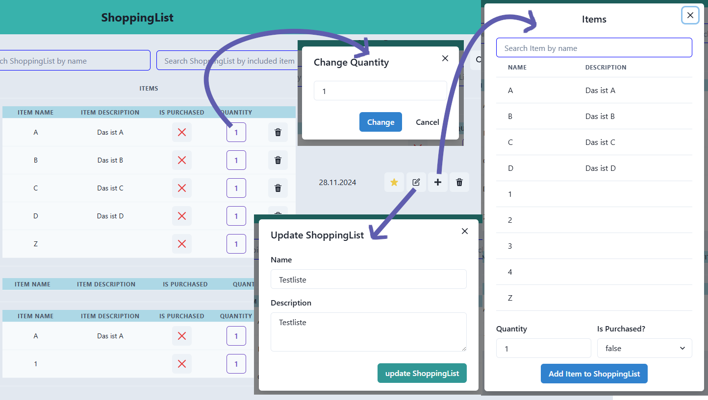
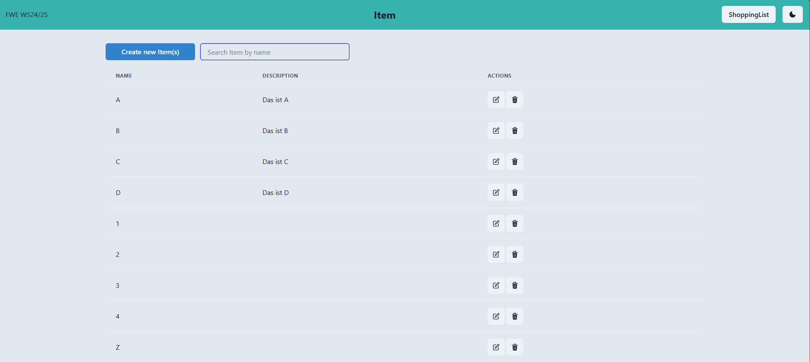
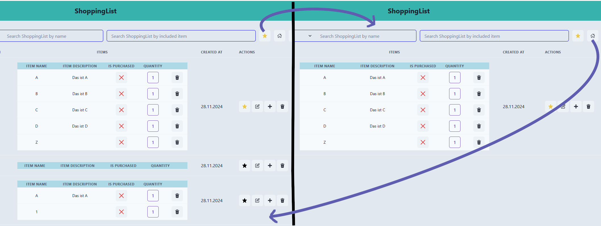
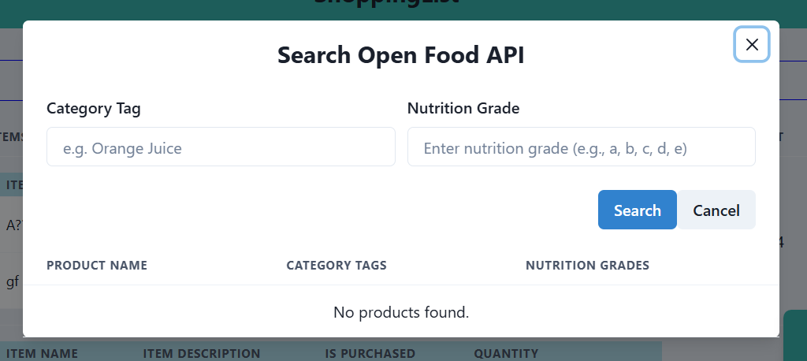
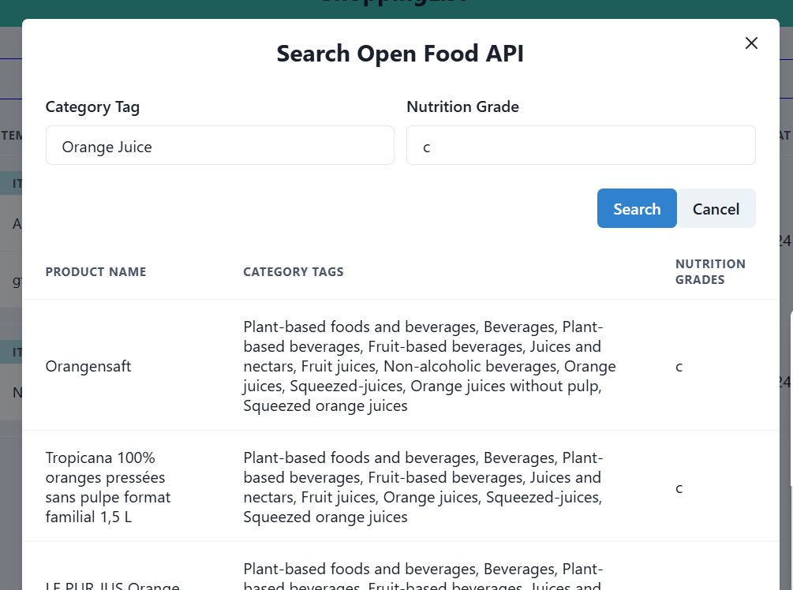

# FWE WS24/25 Homework-Project: ShoppingList Web Application



## Table of Contents

1. [Installation / Getting started](#installation--getting-started)
2. [Application Functionalities](#application-functionalities)
3. [Routes](#routes)
4. [Tests](#tests)

---

---

## Installation / Getting started

### Prerequisites

Ensure the following software components are installed on your PC:

- [ ] Node.js (JavaScript runtime environment)
- [ ] npm (Node Package Manager)
- [ ] Git
- [ ] Docker and Docker Compose

1. Install __Node.js__ and __npm__

   Visit the [Node.js website](https://nodejs.org/).
   Download the recommended version for your platform (LTS version is recommended).
   Follow the installation instructions for your operating system.
   Verify the installation:

    ```bash
    node -v
    npm -v
    ```

2. Install __Git__

   Visit the [Git website](https://git-scm.com/).
   Download the recommended version for your platform.
   Follow the installation instructions for your operating system.
   Verify the installation:

    ```bash
    git --version
    ```

3. Install __Docker__ and __Docker Compose__

   Visit the [Docker website](https://www.docker.com/).
   Download the recommended version for your platform.
   Follow the installation instructions for your operating system.
   Verify the installation:

    ```bash
    docker --version
    docker-compose --version
    ```

### Clone the Repository

Clone the repository to your local machine:

```bash
git clone https://code.fbi.h-da.de/sthiohnoo/fwe-ws-24-25-1120617.git
```

### Backend Setup

### Step 1: Navigate to the Backend Directory

```bash
cd fwe-ws-24-25-1120617/backend
```

### Step 2: Install Dependencies

Install the necessary dependencies using npm:

```bash
npm install
```

### Step 3: Set Up Environment Variables

To configure the application to use the database in Docker, follow these steps:

1. Create a `.env` file in the src directory and copy the `.env.example` file content into it.
2. Edit the `.env` file and replace the placeholders(user, password, database) with the actual values from
   `docker-compose.yml`

### Step 4: Set Up the Database

Set up the database using Docker Compose:

```bash
docker-compose up -d
```

### Step 5: Migrate the Database

Run the database migrations to create the necessary tables:

```bash
npm run db:migrate
```

### Step 6: Build the Backend

```bash
npm run build
```

### Step 7: Start the Backend

```bash
npm start
```

## Frontend Setup

### Step 1: Navigate to the frontend directory:

```bash
cd frontend
```

### Step 2: Install Dependencies

Install the necessary dependencies using npm:

```bash
npm install
```

### Step 3: Build the Frontend

```bash
npm run build
```

### Step 4: Start the Frontend

```bash
npm run preview
```

### Step 4: Access the Application

Open a browser and navigate to `http://localhost:4173/` or click the link in the terminal.

---
___

## Application Functionalities

### Main Functionalities [➡️](#main-shoppinglist-page--item-page)

- [ ] __Manage Shopping Lists:__ Create, read, update, and delete shopping lists.
- [ ] __Manage Items:__ Create, read, update, and delete items.

### Additional Functionalities [➡️](#additional-functionalities)

- [ ] __Database Connection:__ Connects to a PostgreSQL database to store and retrieve data.
- [ ] __Health Check:__ Checks the status of the application.
- [ ] __Freestyle Task #1 / #2__

---

### Main: ShoppingList Page & Item Page

This web application has two different pages, each responsible for managing the shopping lists and items, but also
offering other functionalities. Switching between these two pages is done by clicking on the button in the top right
corner of the navigation bar. Additionally, there is another button next to it with a moon (or sun) symbol to switch
between light and dark mode. When opening/reloading the pages, all existing shopping lists and items are displayed by
default.


Let us first take a look at the selection bar above the shopping list table. Starting from the left, we have a button
for creating new shopping lists. Next, there are two input fields for searching specific shopping lists. The three icons
on the right edge are used for executing freestyle tasks and will be described in more detail in the corresponding
[section](#freestyle-task-1).


<div style="display: flex; align-items: center;">
    
    <span>When creating a shopping list, a modal opens to allow detailed information about the shopping list to be entered. This
includes the name, description, and the items to be added. Only the name is required for creation. Existing items can be
selected using the select box. Items that do not yet exist can also be added. These will automatically be created as new
items once the shopping list is saved. The status and quantity of all items added in this way are set to false and 1 by default.

The first search field allows us to search for shopping lists based on their name or description. The linked select box
to the left of the input field enables switching between searching by name and description. The input field next to it
is used to search for shopping lists containing specific items. All shopping lists that include the searched item will
be displayed.

> `note` Ideally, I would have designed the search functionality for the shopping list by item name in such a way that
> it
> allows
> searching with only part of the name. Currently, however, the full name must be entered; otherwise, an empty list is
> returned. _(Example: __ItemName:__ `Item 1`, __Input:__ `Item` &#8594; __Result:__ `Empty list`, __Input:__ `Item 1`
&#8594; __Result__: `Shopping lists with
Item 1`)_. This could be implemented by establishing the database query with "LIKE." However, this change to the
> existing
> code caused errors in other parts of the application, so I decided not to implement it. Implementing a completely new
> function for the search was not feasible due to time constraints and a lack of motivation. 😊</span>
</div>

Next, let's take a closer look at an entry in the ShoppingList table. Each entry contains the columns Name, Description,
Items, Created At, and Actions. In the Items column, all items contained in the ShoppingList are displayed. The item
name, item description, status (whether purchased or not), and the desired quantity are shown. The status and quantity
are displayed through a button, which provides a convenient way to change the status or edit the quantity.


Here is a more detailed explanation of the individual icon buttons:
> `note` The icons used here in the README do not exactly match the ones in the application.

| IconButtons | Function                                                                                                                                                                                                                                                                                                                                                                                                                       |
|:------------|--------------------------------------------------------------------------------------------------------------------------------------------------------------------------------------------------------------------------------------------------------------------------------------------------------------------------------------------------------------------------------------------------------------------------------|
| ✔️ / ❌      | ✔️(true) and ❌(false) symbolize whether the item has already been purchased or not. By simply clicking, you can toggle the states.                                                                                                                                                                                                                                                                                             |
| 1️⃣         | The number inside the button represents the desired quantity of the item. By clicking, a modal opens where you can easily change the quantity.                                                                                                                                                                                                                                                                                 |
| 🗑️         | The trash can is used in two areas. Once next to each item in a shopping list and once in the actions of each individual shopping list. The functionality is very similar. On the one hand, it should delete the desired item from the shopping list, and on the other hand, you can delete an entire shopping list.                                                                                                           |
| ⭐           | The star is used to mark or unmark a shopping list as a favorite. As a feature of the freestyle task, it is explained in more detail in the corresponding [section](#freestyle-task-1).                                                                                                                                                                                                                                        |
| 📝          | The update symbol opens a modal where the name and description of the shopping list can be changed. <br/>  `note` Initially, the idea was to change not only the name and description but also the status and quantity of an item. This behavior was also implemented in the backend, but due to the complexity of the implementation in the frontend, the editing of item properties was separated into individual functions. |
| ➕           | The plus symbol is used to add new items to a shopping list. A modal opens, listing all existing items. An item can be selected, and the quantity and whether it has already been purchased can be specified. For quickly searching for a specific item, a search field is also available. The found item is automatically selected.                                                                                           |



---

Next, let's take a look at the item page. Since the basic structure is almost the same as the shopping list page, we
will only briefly go over individual elements. Just like on the shopping list page, there is a button at the top left to
open a modal to create new items. Within the modal, the user has the option to create one or more items simultaneously.
Next to the create button is a search field for searching for specific items by name. An item has a name and a
description. In the
actions column, there are the same icons for editing and deleting an item as on the shopping list page. One difference
from the shopping list is that an item cannot have the same name. This must be considered when creating and editing an
item. When deleting, it must also be ensured that the item is not contained in a shopping list. If the mentioned actions
are attempted, the user will be informed with an error message.


---

### Additional Functionalities

### Database Connection

The application uses a PostgreSQL database to store and retrieve data. With Drizzle ORM, tables in the database can be
easily created, modified, and deleted. Schemas are defined to describe the structure of the tables. Drizzle
ORM uses these schemas to generate migrations. Migrations are scripts that contain the necessary SQL commands to create
or modify tables. Once a migration is executed, the table is created or updated in the database according to the schema
definition. If changes to the table structure are necessary, they must first be made in the schema. Then, a new
migration is generated and executed to apply the changes to the database.

In this project, three schemas or tables were designed:

1. Shopping Lists Table: This table stores all shopping lists. Each shopping list is stored here with its relevant
   information, such as ID, name, description, isFavorite, and createdAt.
2. Items Table: This table stores all available items that can be added to a shopping list. Each item is stored with its
   ID, name, and description.
3. Relationship Table: To represent the relationship between individual items and shopping lists, a third table was
   created. This serves as a relationship table and stores additional information, such as:
    - The quantity of items in a shopping list.
    - The status of an item (e.g., whether it has been checked off).

   The relationship table allows modeling a many-to-many relationship between shopping lists and items while also
   capturing details about this relationship.

```typescript
// ShoppingList schema
export const shoppingList = pgTable('shopping_list', {
  ...commonSchema,
  isFavorite: boolean('is_favorite').default(false).notNull(),
  createdAt: timestamp('created_at').defaultNow().notNull(),
});

export const shoppingListRelations = relations(shoppingList, ({ many }) => ({
  shoppingListItems: many(shoppingListItem),
}));
```

```typescript
// Item schema
export const item = pgTable(
  'item',
  {
    ...commonSchema,
  },
  (table) => ({
    unq: unique().on(table.name),
  }),
);

export const itemRelations = relations(item, ({ many }) => ({
  shoppingListItems: many(shoppingListItem),
}));
```

```typescript
// ShoppingListItem schema
export const shoppingListItem = pgTable(
  'shopping_list_item',
  {
    listId: uuid('list_id')
      .references(() => shoppingList.id)
      .notNull(),
    itemId: uuid('item_id')
      .references(() => item.id)
      .notNull(),
    quantity: integer('quantity').notNull(),
    isPurchased: boolean('is_purchased').default(false).notNull(),
  },
  (t) => ({
    pk: primaryKey({ columns: [t.listId, t.itemId] }),
  }),
);

export const shoppingListItemRelations = relations(shoppingListItem, ({ one }) => ({
  shoppingList: one(shoppingList, {
    fields: [shoppingListItem.listId],
    references: [shoppingList.id],
  }),
  item: one(item, {
    fields: [shoppingListItem.itemId],
    references: [item.id],
  }),
}));
```

### Freestyle Task #1

You might have a list of purchases that you make regularly over a certain period. Perhaps you want to save ingredients
from recipes so you don't have to research them every time. This feature was developed exactly for that purpose. You can
now save shopping lists as favorites, so you can easily access important shopping lists at a later time without any
problems. There is a star icon ⭐ next to each shopping list in the actions-column. By clicking on it, you can mark a
shopping list as a favorite. The star icon changes its color to yellow to indicate that the shopping list is a favorite.
If you click on the star icon again, the shopping list is no longer marked as a favorite. The color turns back to black.
To display all shopping lists marked as favorites, there is another icon in the selection bar next to the search field.
If you want to display all existing shopping lists again, you can either click on the home icon or reload the page.



### Freestyle Task #2

If you want to buy certain items, you might wonder if there are alternatives with better quality. For this purpose, a
feature has been developed to search for specific items (in this case, groceries) paired with the Nutri-Score. The user
is
provided with a list of similar groceries with the desired Nutri-Score through the search. The API from Open Food Facts
is
used to obtain external data.

In the top right corner of the selection bar of the shopping list page, there is a search icon 🔍 that you can click on



When clicked, a modal opens where you can search for groceries by category tags and desired Nutri-Score. The search
returns a list of food items that match the criteria. Here in the example, `Orange Juice` with Nutri-Score `c`.



> __Important Note__
>
>The website that provides this external API requires limiting the rate of API requests per minute to
> protect their infrastructure. To ensure this protection, a delay of 6 seconds between requests has been implemented
> using `Bottleneck`. However, this is not the best solution, as every request, regardless of whether previous requests
> have been made or not, must wait 6 seconds for a response. For the purposes of this project, however, this is
> sufficient
> for now.
[Documentation Open Api Facts](https://openfoodfacts.github.io/openfoodfacts-server/api/).

---

---

## Routes

Here in this section, you will find an overview of the structure of the routes.

__ShoppingList Routes__

- [ ] GET /shoppingLists
    - Description: Retrieves all shopping lists.
    - Response: 200 OK, array of shopping lists.
- [ ] GET /shoppingLists/search
    - Description: Retrieves shopping lists with a specific name or description.
    - Response: 200 OK, array of shopping lists.
    - Errors: 404 Not Found.
- [ ] GET /shoppingLists/:shoppingListId
    - Description: Retrieves a shopping list by its ID.
    - Response: 200 OK, shopping list object.
    - Errors: 404 Not Found, 400 Bad Request (invalid ID format).
- [ ] GET /shoppingLists/items/:itemId
    - Description: Retrieves shopping lists containing a specific item by its ID.
    - Response: 200 OK, array of shopping lists.
    - Errors: 404 Not Found, 400 Bad Request (invalid ID format).
- [ ] POST /shoppingLists
    - Description: Creates a new shopping list.
    - Request Body: JSON object with name (required), description (optional) and items array (optional). The items array
      contains multiple objects, each representing an item with its own properties such as id, name, and description.
    - Response: 201 Created, shopping list object.
- [ ] PUT /shoppingLists/:shoppingListId
    - Description: Updates a shopping list by its ID.
    - Request Body: JSON object with name (optional), description (optional), and items array(optional). The items array
      contains multiple objects, each representing an item with its relation properties such as quantity and
      isPurchased.
    - Response: 200 OK, updated shopping list object.
    - Errors: 404 Not Found, 400 Bad Request (invalid ID format).
- [ ] PUT /shoppingLists/:shoppingListId/items/:id
    - Description: Adds an item to a shopping list by its ID.
    - Request Body: JSON object with quantity (required) and isPurchased (optional).
    - Response: 201 Created, item object.
    - Errors: 404 Not Found, 400 Bad Request (invalid ID format), 409 Conflict (item already in list).
    - > `note` Adding an item is logically updating a shopping list, but it is technically creating a new row in the
      shoppingListItem table. Therefore, I wasn't sure if the correct request is a PUT or POST. However, I decided to
      use for response a 201 for the creation.
- [ ] PATCH /shoppingLists/toggle/:shoppingListId/:itemId
    - Description: Toggles the status of an item in a shopping list by its ID.
    - Response: 200 OK, updated shoppingList object.
    - Errors: 404 Not Found, 400 Bad Request (invalid ID format).
- [ ] PATCH /shoppingLists/updateQuantity/:shoppingListId/:itemId
    - Description: Updates the quantity of an item in a shopping list by its ID.
    - Request Body: JSON object with quantity (required).
    - Response: 200 OK, updated shoppingList object.
    - Errors: 404 Not Found, 400 Bad Request (invalid ID format).
- [ ] DELETE /shoppingLists/:shoppingListId/items/:itemId
    - Description: Deletes an item from a shopping list by its ID.
    - Response: 204 No Content.
    - Errors: 404 Not Found, 400 Bad Request (invalid ID format).
- [ ] DELETE /shoppingLists/:shoppingListId
    - Description: Deletes a shopping list by its ID.
    - Response: 204 No Content.
    - Errors: 404 Not Found, 400 Bad Request (invalid ID format).
- [ ] GET /shoppingLists/search/favorites
    - Description: Retrieves all favorite shopping lists.
    - Response: 200 OK, array of shopping lists.
- [ ] PUT /shoppingLists/:shoppingListId/favorites
    - Description: Updates the favorite status of a shopping list by its ID.
    - Request Body: JSON object with isFavorite (required).
    - Response: 200 OK, updated shopping list object.
    - Errors: 404 Not Found, 400 Bad Request (invalid ID format).

__Item Routes__

- [ ] GET /items
    - Description: Retrieves all items.
    - Response: 200 OK, array of items.
- [ ] GET /items/:itemId
    - Description: Retrieves an item by its ID.
    - Response: 200 OK, item object.
    - Errors: 404 Not Found, 400 Bad Request (invalid ID format).
- [ ] GET /items/name/:itemName
    - Description: Retrieves items with a specific name.
    - Response: 200 OK, array of items.
    - Errors: 404 Not Found.
- [ ] POST /items
    - Description: Creates a new item.
    - Request Body: JSON array of objects, each with name (required) and description (optional).
    - Response: 201 Created, item object.
    - Errors: 409 Conflict (item already exists).
- [ ] PUT /items/:itemId
    - Description: Updates an item by its ID.
    - Request Body: JSON object with name (optional) and description (optional).
    - Response: 200 OK, updated item object.
    - Errors: 404 Not Found, 400 Bad Request (invalid ID format), 409 Conflict (item with same name exists).
- [ ] DELETE /items/:id
    - Description: Deletes an item by its ID.
    - Response: 204 No Content.
    - Errors: 404 Not Found, 400 Bad Request (invalid ID format), 409 Conflict (item in use).

---

---

## Tests

In this project, we have two main types of tests: repository tests and controller tests. Each type of test serves a
different purpose and focuses on different aspects of the application. We use Jest and Supertest for testing, and we
also utilize helper functions to mock data.

__Repository Tests__

Repository tests (...repository.spec.ts) focus on the data access layer. These tests verify the functionality
of the repository methods that interact directly with the database. They ensure that CRUD (Create, Read, Update, Delete)
operations are performed correctly.

__Controller Tests__

Controller tests (...controller.spec.ts) focus on the API endpoints. These tests verify the HTTP requests and
responses to ensure that the endpoints are functioning correctly and returning the expected results. They also test the
integration between the controller and the repository.

__Running Tests__

To run the tests, use the following command:

```bash 
cd backend
npm test
```

To display the test coverage, use the following command:

```bash
npm run test:coverage
```

If you also want to test the built files in the dist directory, then remove `'<rootDir>/dist/'` from the following lines
from jest.config.js:

```
  testPathIgnorePatterns: ['<rootDir>/test/helpers/', '<rootDir>/dist/'],
  coveragePathIgnorePatterns: ['<rootDir>/test/helpers/', '<rootDir>/dist/'],
```

__Testing with Postman__

In addition to automated tests, you can also test the API endpoints manually using Postman. To test with Postman, import
the collection file `FWE.postman_collection.json` which you can find in
`/backend/docs`into Postman.
The collection contains requests for all API endpoints, including examples of request bodies.
